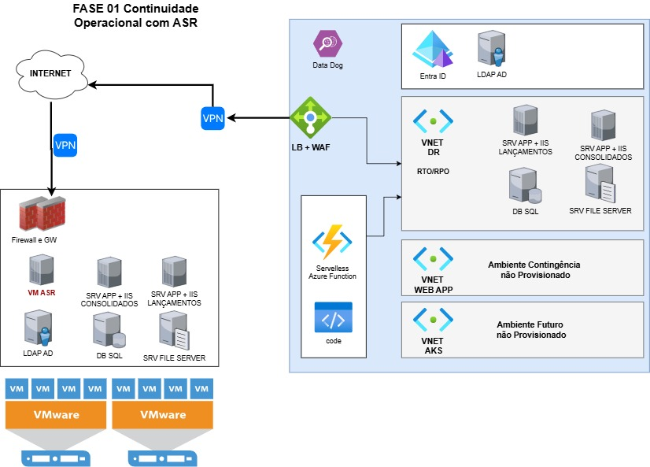

# Fase 1 - Continuidade Operacional com DR Híbrido

- Implementar conectividade entre ambiente On-Premises e Azure utilizando VPN com BGP para failover automático.
- Criar ambiente de Disaster Recovery utilizando Azure Site Recovery (ASR) para replicar workloads críticos (APP, DB, File Server).
- Utilizar mesma sub-rede (range de IP) entre on-premises e Azure para facilitar DNS, firewall e simplificar failover.
- Utilizar Application Gateway + WAF como ponto de entrada, com fallback automático para DR.
- Automatizar ativação do ambiente DR via Azure Functions (IaC).

[<< Previous](README.md)   -   [Next Page >>](Topologia_Fase-02_WebApp.md)
